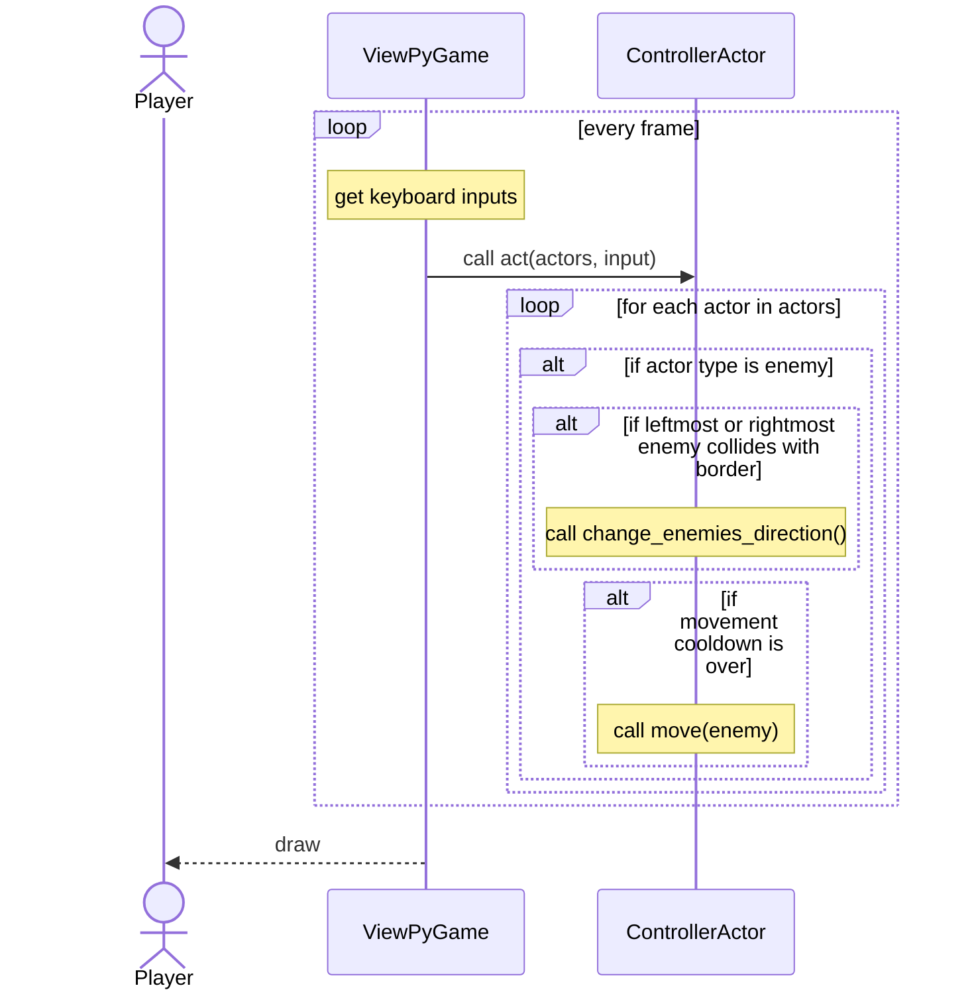

```mermaid
sequenceDiagram
    actor Player
    participant ViewPyGame
    participant ControllerActor

    loop every frame
        note over ViewPyGame: get keyboard inputs
        ViewPyGame ->>ControllerActor: call act(actors, input)
        loop for each actor in actors
            alt if actor type is enemy
                alt if leftmost or rightmost enemy collides with border
                    note over ControllerActor:call change_enemies_direction()
                end
                alt if movement cooldown is over
                    note over ControllerActor:call move(enemy)
                end
            end
        end
    end
    ViewPyGame-->>Player: draw

```