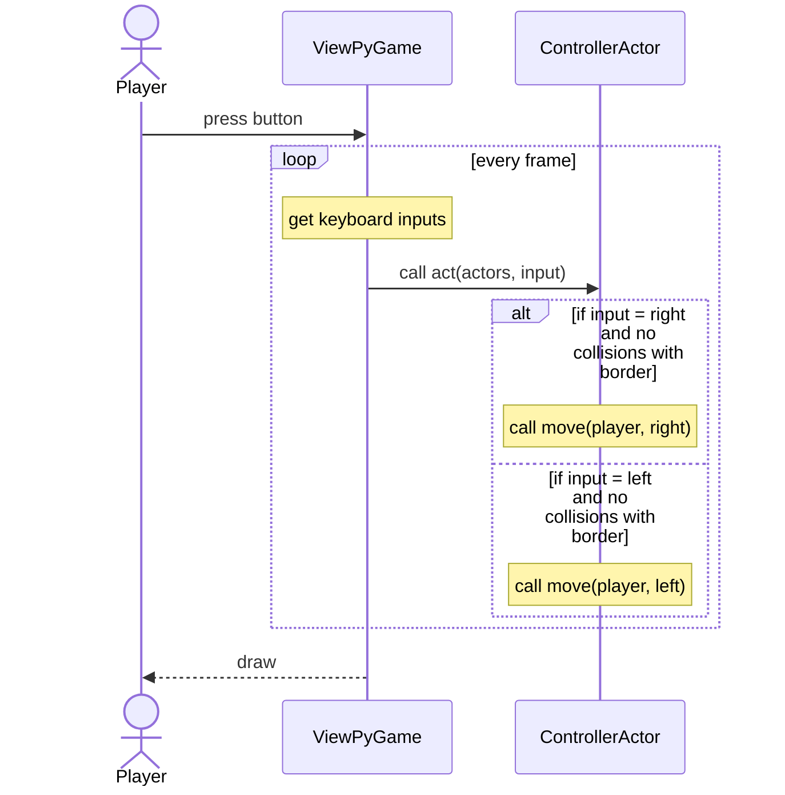

```mermaid
sequenceDiagram
    actor Player
    participant ViewPyGame
    participant ControllerActor

    Player->>ViewPyGame: press button
    loop every frame
        note over ViewPyGame: get keyboard inputs
        ViewPyGame->>ControllerActor: call act(actors, input)
        alt if input = right and no collisions with border
            note over ControllerActor:call move(player, right)
        else if input = left and no collisions with border
            note over ControllerActor:call move(player, left)

        end
    end
    ViewPyGame-->>Player: draw
```