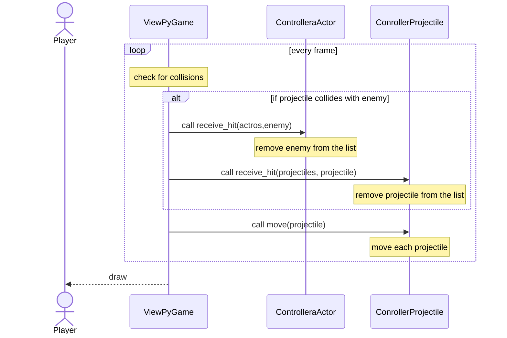

```mermaid
sequenceDiagram
    actor Player
    participant ViewPyGame
    participant ControlleraActor
    participant ConrollerProjectile

    loop every frame
        note over ViewPyGame: check for collisions
        alt if projectile collides with enemy
            ViewPyGame ->> ControlleraActor: call receive_hit(actros,enemy)
            note over ControlleraActor: remove enemy from the list
            ViewPyGame ->> ConrollerProjectile: call receive_hit(projectiles, projectile)
            note over ConrollerProjectile: remove projectile from the list
        end
        
        ViewPyGame ->> ConrollerProjectile: call move(projectile)
        note over ConrollerProjectile: move each projectile
    end
    ViewPyGame -->> Player: draw
```