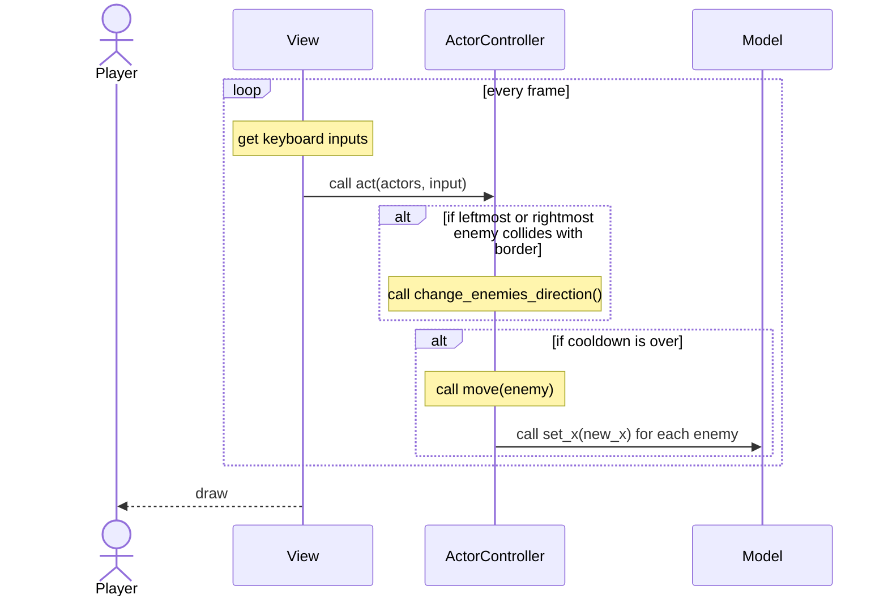

```mermaid
sequenceDiagram
    actor Player
    participant View
    participant ActorController
    participant Model

    loop every frame
        note over View: get keyboard inputs
        View->>ActorController: call act(actors, input)
        alt if leftmost or rightmost enemy collides with border
            note over ActorController:call change_enemies_direction()
        end
        alt if cooldown is over
            note over ActorController:call move(enemy)
            ActorController->>Model: call set_x(new_x) for each enemy
        end
    end
    View-->>Player: draw

```