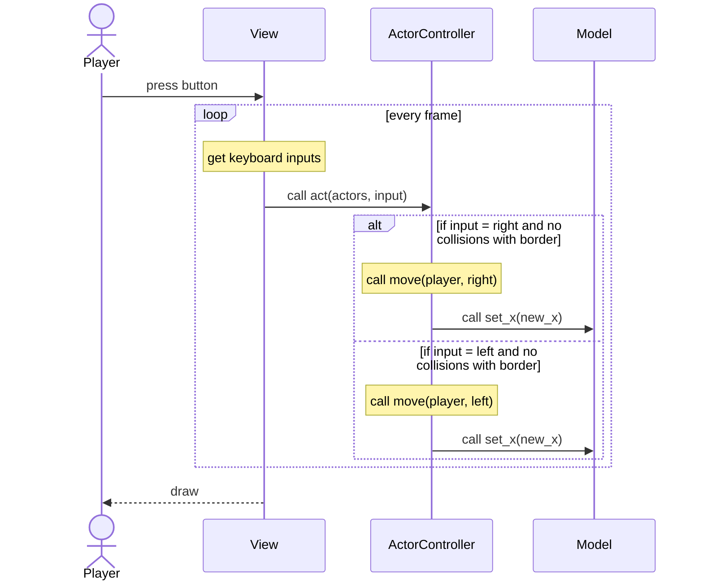

```mermaid
sequenceDiagram
    actor Player
    participant View
    participant ActorController
    participant Model

    Player->>View: press button
    loop every frame
        note over View: get keyboard inputs
        View->>ActorController: call act(actors, input)
        alt if input = right and no collisions with border
            note over ActorController:call move(player, right)
            ActorController->>Model: call set_x(new_x)
        else if input = left and no collisions with border
            note over ActorController:call move(player, left)
            ActorController->>Model: call set_x(new_x)

        end
    end
    View-->>Player: draw
```