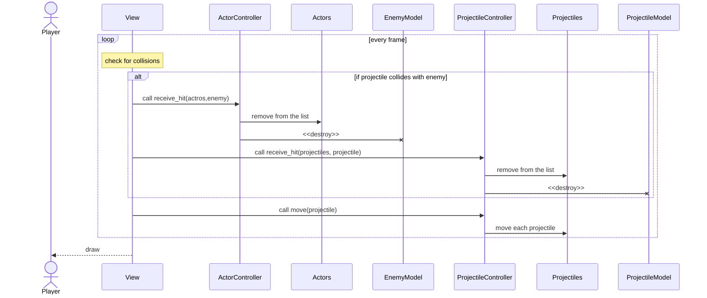

```mermaid
sequenceDiagram
    actor Player
    participant View
    participant ActorController
    participant Actors
    participant EnemyModel
    participant ProjectileController
    participant Projectiles
    participant ProjectileModel

    loop every frame
        note over View: check for collisions
        alt if projectile collides with enemy
            View ->> ActorController: call receive_hit(actros,enemy)
            ActorController ->> Actors: remove from the list
            ActorController -X EnemyModel: <<destroy>>
            View ->> ProjectileController: call receive_hit(projectiles, projectile)
            ProjectileController ->> Projectiles: remove from the list
            ProjectileController -x ProjectileModel: <<destroy>>
        end
        
        View ->> ProjectileController: call move(projectile)
        ProjectileController ->> Projectiles: move each projectile
    end
    View -->> Player: draw
```